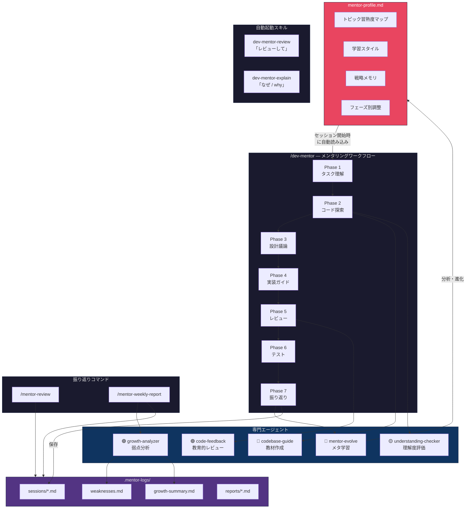

# Dev Mentor Skills

メンティーの開発ライフサイクル全体をガイドするAIメンタリングプラグイン — 代わりに作るのではなく、自分で作れるように導きます。

**Claude Code** と **OpenAI Codex** の両方に対応。

---

## 機能一覧

| 機能 | 説明 |
|------|------|
| `/dev-mentor` | 7フェーズのメンタリングセッション（理解→探索→設計→実装→レビュー→テスト→振り返り） |
| `/mentor-review` | 過去のセッションログ閲覧、弱点追跡、成長トレンド表示 |
| `/mentor-weekly-report` | 上長提出用の週次レポートを自動生成（指標・評価付き） |
| 自動起動スキル | 自然言語で教育的コードレビューや概念説明が起動 |

### メンタリングの方針

メンターはメンティーの**代わりにコードを書きません**。代わりに：

- ソクラテス式の質問で理解を深める
- **ヒントラダー**で段階的にサポート（概念的→具体的→擬似コード→ファイル直接指示）
- コードレビューの問題を**指摘ではなく質問**で提示
- 問題点の前に**良かった点**を必ず伝える
- メンティーのスキルレベルに自動で適応

### セッションログと成長追跡

メンタリングセッションは `.mentor-logs/` に自動記録されます：

```
.mentor-logs/
├── sessions/           # セッションごとの記録（スコア、躓きポイント）
├── reports/            # 週次レポート
├── weaknesses.md       # セッション横断の弱点パターン
└── growth-summary.md   # スキルの推移
```

## インストール

### Claude Code

```bash
# ローカルテスト
claude --plugin-dir /path/to/dev-mentor-skills

# クローンして使用
git clone https://github.com/kazuki1213/dev-mentor-skills.git
claude --plugin-dir ./dev-mentor-skills
```

### OpenAI Codex

プロジェクトまたはホームディレクトリにクローン：

```bash
# プロジェクトスコープ
git clone https://github.com/kazuki1213/dev-mentor-skills.git
cp -r dev-mentor-skills/.codex .codex
cp -r dev-mentor-skills/.agents .agents
cp dev-mentor-skills/AGENTS.md AGENTS.md

# ユーザースコープ
cp -r dev-mentor-skills/.codex/agents/* ~/.codex/agents/
cp -r dev-mentor-skills/.agents/skills/* ~/.agents/skills/
cp dev-mentor-skills/AGENTS.md ~/.codex/AGENTS.md
```

## 使い方

### メンタリングセッションの開始

```
/dev-mentor ユーザープロフィール用のREST APIエンドポイントを追加する
```

メンターが7つのフェーズをガイドします：

1. **タスク理解** — タスクを自分の言葉で説明
2. **コードベース探索** — 誘導質問で関連コードを読み解く
3. **設計議論** — アプローチを提案し、トレードオフを評価
4. **実装ガイダンス** — ヒント付きでステップごとに構築
5. **コードレビュー** — まず自己レビュー、次に教育的フィードバック
6. **テストガイダンス** — テストケースを設計し、テストを書く
7. **振り返りとログ保存** — 学びを整理し、セッションログを保存

### 過去のセッションを振り返る

```
/mentor-review                  # 直近のセッション概要
/mentor-review weaknesses       # 弱点パターンとトレンド
/mentor-review growth           # 成長サマリーと指標
/mentor-review session 2026-03-24  # 特定セッションの詳細
```

### 週次レポートの生成

```
/mentor-weekly-report              # 直近7日間
/mentor-weekly-report 2026-03-17   # 指定日からの1週間
```

レポートは `.mentor-logs/reports/` に保存され、上長がそのまま確認できる形式です。

## アーキテクチャ



### エージェント

| エージェント | 役割 |
|-------------|------|
| `codebase-guide` | コードベースを探索し、誘導質問付きの教材を作成 |
| `understanding-checker` | メンティーの回答を0-100で評価、誤解を特定 |
| `code-feedback` | 教育的コードレビュー（問題をカテゴリ付き質問で提示） |
| `growth-analyzer` | セッション横断の弱点パターンと成長トレンドを分析 |
| `mentor-evolve` | メタ学習 — 教え方の効果を分析し、メンタープロファイルを進化 |

### 適応型メンタリング

メンターは**使えば使うほど賢くなります**。セッション終了時に `mentor-evolve` エージェントが蓄積データを分析し、メンタープロファイル（`.mentor-logs/mentor-profile.md`）を更新します：

- メンティーの学習スタイルとスキルレベル
- トピック別の習熟度マップ（トピックごとのサポート量を推奨）
- 効果的だった教え方 / 避けるべき教え方
- フェーズごとのカスタマイズ（例：「エラーハンドリングはヒントレベル2から開始」）
- 成長軌道に基づく次の課題の予測

プロファイルは毎セッション開始時に読み込まれ、メンターのアプローチが自動で適応します。

### 自動起動スキル

| スキル | トリガー |
|--------|---------|
| `dev-mentor-review` | 「レビューして」「コードを見て」「check my code」 |
| `dev-mentor-explain` | 「なぜ」「どうして」「why」の質問 |

## ファイル構成

```
dev-mentor-skills/
├── .claude-plugin/plugin.json         # Claude Codeプラグインメタデータ
├── AGENTS.md                          # Codex用メンターペルソナ
├── commands/                          # Claude Codeスラッシュコマンド
│   ├── dev-mentor.md
│   ├── mentor-review.md
│   └── mentor-weekly-report.md
├── agents/                            # Claude Codeエージェント (.md)
├── .codex/agents/                     # Codexエージェント (.toml)
├── .agents/skills/                    # Codexスキル
├── skills/                            # 自動起動スキル
├── scripts/save-session-log.sh        # ログディレクトリ初期化
├── templates/weekly-report.md         # レポートテンプレート
└── references/                        # メンタリング手法ドキュメント
```

## ライセンス

MIT

---

**[English documentation](./README.md)**
