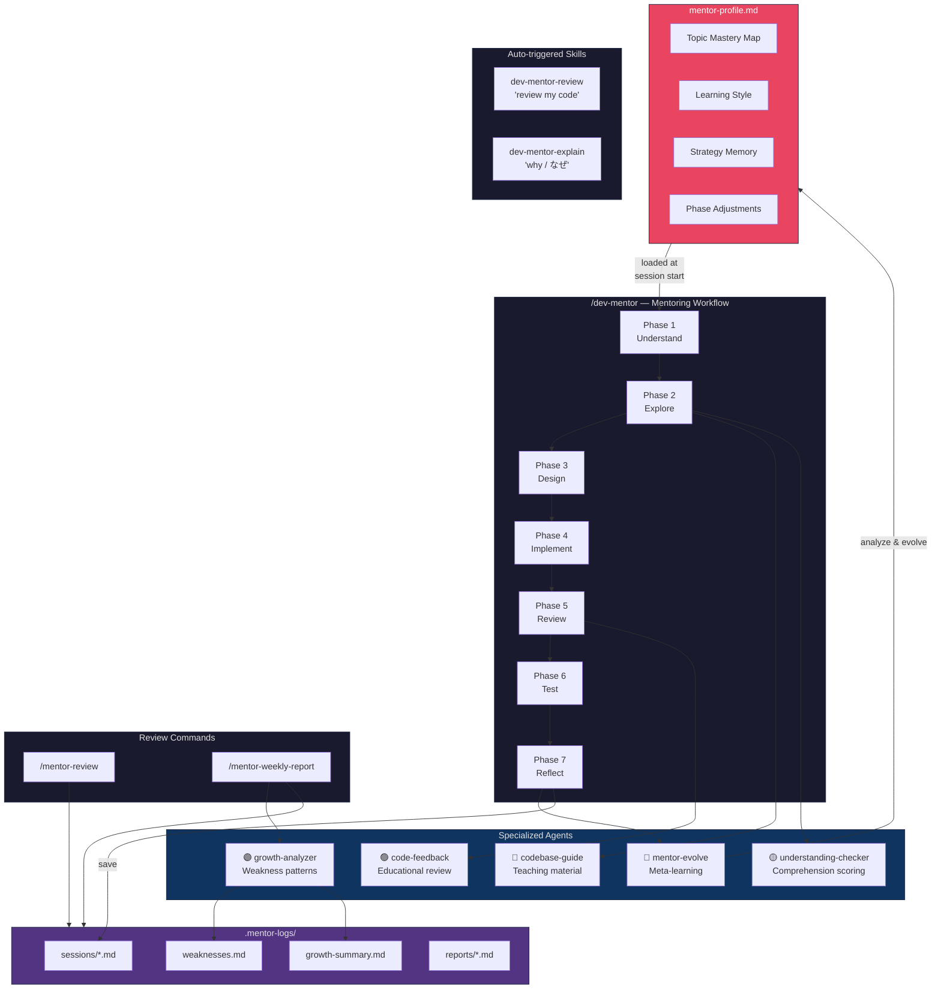

# Dev Mentor Skills

AI-powered mentoring plugin that guides mentees through the full development lifecycle — teaching them to build, not building for them.

Works with both **Claude Code** and **OpenAI Codex**.

---

## Features

| Feature | Description |
|---------|-------------|
| `/dev-mentor` | 7-phase guided mentoring session (understand → explore → design → implement → review → test → reflect) |
| `/mentor-review` | Browse past session logs, track weaknesses, view growth trends |
| `/mentor-weekly-report` | Generate weekly reports for managers with metrics and assessments |
| Auto-triggered skills | Educational code review and concept explanation activate on natural language |

### Mentoring Philosophy

The mentor **never writes code** for the mentee. Instead, it:

- Asks Socratic questions to deepen understanding
- Uses a **Hint Ladder** (conceptual → specific → pseudocode → direct pointer)
- Frames code review issues as **questions**, not directives
- Always highlights what was done **well** before discussing issues
- Adapts guidance to the mentee's skill level automatically

### Session Logging & Growth Tracking

Every mentoring session is logged to `.mentor-logs/`:

```
.mentor-logs/
├── sessions/           # Per-session records with scores and stumbling points
├── reports/            # Weekly reports for managers
├── weaknesses.md       # Cross-session weakness patterns
└── growth-summary.md   # Skill progression over time
```

## Installation

### Claude Code

```bash
# Test locally
claude --plugin-dir /path/to/dev-mentor-skills

# Or clone and use
git clone https://github.com/kazuki1213/dev-mentor-skills.git
claude --plugin-dir ./dev-mentor-skills
```

### OpenAI Codex

Clone into your project or home directory:

```bash
# Project-scoped
git clone https://github.com/kazuki1213/dev-mentor-skills.git
cp -r dev-mentor-skills/.codex .codex
cp -r dev-mentor-skills/.agents .agents
cp dev-mentor-skills/AGENTS.md AGENTS.md

# Or user-scoped
cp -r dev-mentor-skills/.codex/agents/* ~/.codex/agents/
cp -r dev-mentor-skills/.agents/skills/* ~/.agents/skills/
cp dev-mentor-skills/AGENTS.md ~/.codex/AGENTS.md
```

## Usage

### Start a Mentoring Session

```
/dev-mentor Add a REST API endpoint for user profiles
```

The mentor will guide you through 7 phases:

1. **Task Understanding** — Explain the task in your own words
2. **Codebase Exploration** — Navigate relevant code with guided questions
3. **Design Discussion** — Propose and evaluate approaches
4. **Implementation Guidance** — Build step-by-step with hints
5. **Code Review** — Self-review first, then educational feedback
6. **Testing Guidance** — Design test cases and write tests
7. **Reflection & Logging** — Consolidate learning, save session log

### Review Past Sessions

```
/mentor-review                  # Recent sessions overview
/mentor-review weaknesses       # Weakness patterns and trends
/mentor-review growth           # Growth summary and metrics
/mentor-review session 2026-03-24  # Specific session detail
```

### Generate Weekly Report

```
/mentor-weekly-report              # Last 7 days
/mentor-weekly-report 2026-03-17   # Week starting from date
```

Reports are saved to `.mentor-logs/reports/` in a format ready for manager review.

## Architecture



### Agents

| Agent | Role |
|-------|------|
| `codebase-guide` | Explores code and creates teaching material with guided questions |
| `understanding-checker` | Evaluates mentee answers with 0-100 scoring and misconception detection |
| `code-feedback` | Educational code review — issues framed as questions with category tags |
| `growth-analyzer` | Cross-session analysis of weakness patterns and growth trends |
| `mentor-evolve` | Meta-learning — analyzes what teaching strategies work and evolves the mentor profile |

### Adaptive Mentoring

The mentor **gets better the more you use it**. After each session, the `mentor-evolve` agent analyzes accumulated data to build a mentor profile (`.mentor-logs/mentor-profile.md`) that tracks:

- Mentee's learning style and skill level
- Topic mastery map with per-topic scaffolding recommendations
- Which teaching strategies work vs. which to avoid
- Per-phase customizations (e.g., "start hints at level 2 for error handling")
- Predicted next challenges based on growth trajectory

The profile is loaded at the start of every session, so the mentor adapts its approach automatically.

### Auto-Triggered Skills

| Skill | Triggers On |
|-------|-------------|
| `dev-mentor-review` | "review my code", "check my implementation" |
| `dev-mentor-explain` | "why" questions about code, patterns, or architecture |

## File Structure

```
dev-mentor-skills/
├── .claude-plugin/plugin.json         # Claude Code plugin metadata
├── AGENTS.md                          # Codex mentor persona
├── commands/                          # Claude Code slash commands
│   ├── dev-mentor.md
│   ├── mentor-review.md
│   └── mentor-weekly-report.md
├── agents/                            # Claude Code agents (.md)
├── .codex/agents/                     # Codex agents (.toml)
├── .agents/skills/                    # Codex skills
├── skills/                            # Auto-triggered skills
├── scripts/save-session-log.sh        # Log directory setup
├── templates/weekly-report.md         # Report template
└── references/                        # Mentoring methodology docs
```

## License

MIT

---

**[日本語ドキュメントはこちら](./README.ja.md)**
